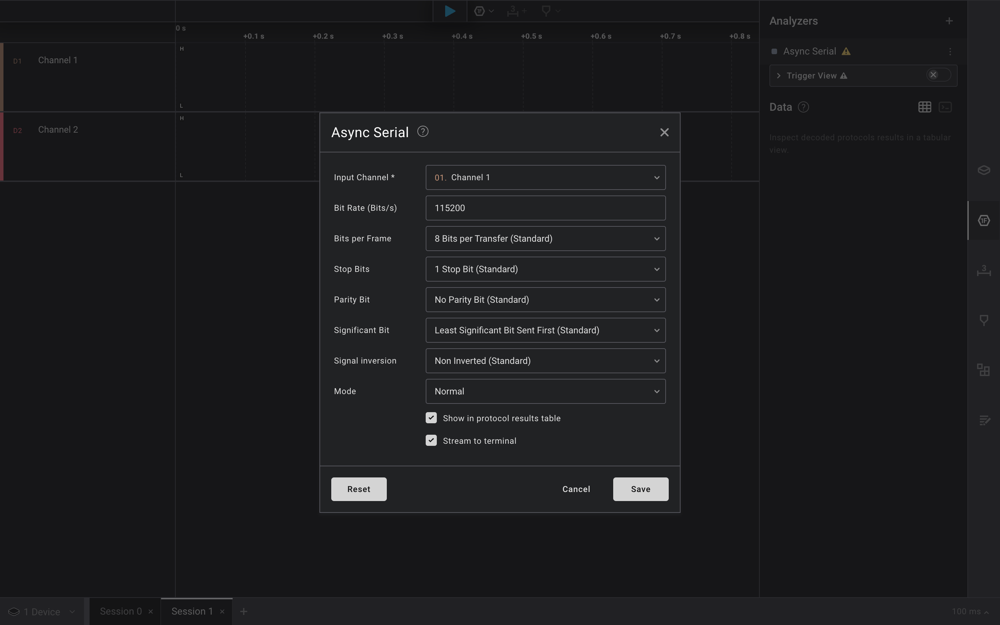
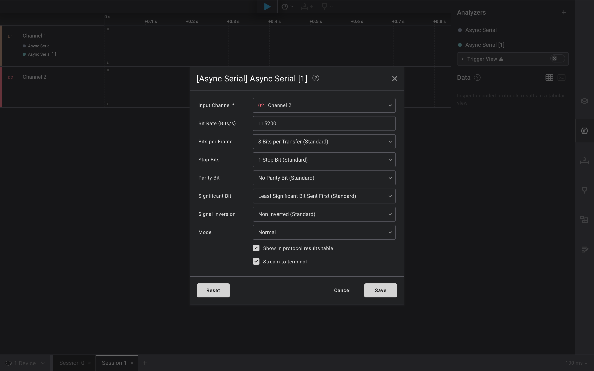
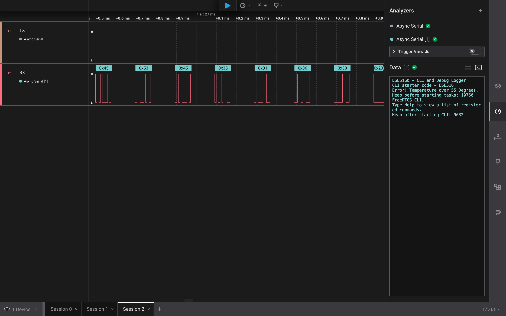

# a07g-exploring-the-CLI

* Team Number: 9
* Team Name: Shorts & Sparks
* Team Members: James Steeman and Timothy Zhang
* GitHub Repository URL: [https://github.com/ese5160/final-project-a07g-a14g-t09-shorts-sparks](https://github.com/ese5160/final-project-a07g-a14g-t09-shorts-sparks)
* Description of test hardware: Macbook pro m2 (macOS) and lab desktops (windows) (development boards, sensors, actuators, laptop + OS, etc)

## 0 Install Percepio

## 1 Software Architecture

### Overall Project Updates / Differences from A00G proposal

| Original | Current |
| -------- | ------- |
| Foam cyllinders 3d model prototypes |  Copper clad FR4 for milling PCB prototypes |
| r(z), y, theta (cyllinder) cnc | x, y, z cnc |
| Battery backup power in wall power outage case | Approved removal of battery as PCB milling times are faster so it is less expected and a less significant issue to lose power in the middle of a job |

### Updated Hardware Requirements Specification (HRS)

| Req ID | Requirement | Review |
| ------ | ----------- | ------ |
| HRS-01 | The CNC router shall use 3 stepper motors to control one rotational axis and 2 linear axis (cylindrical coordinates) | N/A |
| HRS-02 | The CNC router shall use 1 DC motor for spindle                                                                                                     | N/A    |
| HRS-03 | The system shall have external non-voilatile memory (microSD) of no less than 512MB for storing G-code and current progress (in any pause scenario) | N/A    |
| HRS-04 | The CNC router shall be able to cut foam material                                                                                                   | N/A    |
| HRS-05 | The CNC shall have a milling volume of 300cm^3 (similar to a can of coke)                                                                           | N/A    |
| HRS-06 | The CNC shall run off a wall outlet during operation                                                                                                | N/A    |
| HRS-07 | The CNC shall run off a single cell Li-Ion battery (3.7V nominal voltage) during power outage (sleep mode)                                          | N/A    |
| HRS-08 | The system shall use the SAMW25 as the microcontroller and Wi-Fi communication IC                                                                   | N/A    |
| HRS-09 | The stepper motors shall use encoders for closed loop feedback                                                                                      | N/A    |
| HRS-10 | The system shall have status indicator LEDs on the PCB                                                                                              | N/A    |
| HRS-11 | The system shall have a power (on/off) switch                                                                                                       | N/A    |

### Updated Software Requirements Specification (SRS)

| Req ID | Requirement | Review |
| ------ | ----------- | ------ |
| SRS-01 | The system shall be able to control all 3 stepper motors in its cyllindrical coordinates | N/A    |
| SRS-02 | The MCU in the SAMW25 module shall run an RTOS | N/A    |
| SRS-03 | The user shall be able to remotely operate the machine, setting presets, start/pause etc | N/A    |
| SRS-04 | The system shall be able to send status updates and job progress to the web portal for the user | N/A    |
| SRS-05 | The system shall be able to read and interoperate encoder values as positions | N/A    |
| SRS-06 | The system shall be able to automatically pause the job when power loss/overheat | N/A    |
| SRS-07 | The system shall be able to perform zeroing (calibration) | N/A    |
| SRS-08 | The system shall be able to resume job from any paused state | N/A    |
| SRS-09 | The user should be able to upload job file remotely through a portal on webpage | N/A    |
| SRS-10 | An OTAFU should be implemented | N/A    |

### Unchanged HRS SRS

* HRS
* HRS
* SRS
* SRS

### Modified HRS SRS

### New HRS SRS

### Block Diagram for software tasks

temp

### Flowcharts and State Machines

temp

## 2 Understanding the Starter Code

### 1: What does “InitializeSerialConsole()” do? In said function, what is “cbufRx” and “cbufTx”? What type of data structure is it?

It initializes the UART circular buffers (RX and TX), configures the usart module and callback functions, set the priority for USART interrupts, and begins reading to the buffer.

``` c
/**
 * @brief Initializes the UART and registers callbacks.
 */
void InitializeSerialConsole(void)
{
    // Initialize circular buffers for RX and TX
   cbufRx = circular_buf_init((uint8_t *)rxCharacterBuffer, RX_BUFFER_SIZE);
   cbufTx = circular_buf_init((uint8_t *)txCharacterBuffer, TX_BUFFER_SIZE);

    // Configure USART and Callbacks
   configure_usart();
    configure_usart_callbacks();
    NVIC_SetPriority(SERCOM4_IRQn, 10);

    usart_read_buffer_job(&usart_instance, (uint8_t *)&latestRx, 1); // Kicks off constant reading of characters

   // Add any other calls you need to do to initialize your Serial Console
}
```

cbufRx and cbufTx are circular buffer handlers: pointers to the circular buffer structure defined in circular_buffer.c

``` c
 // The definition of our circular buffer structure is hidden from the user
 struct circular_buf_t {
   uint8_t * buffer;
    size_t head;
    size_t tail;
    size_t max; //of the buffer
    bool full;
 };
 ```

### 2: How are “cbufRx” and “cbufTx” initialized? Where is the library that defines them (please list the *C file they come from)

They are initialized by calling a function circular_but_init() with parameters cooresponding to rx and tx and their buffer sizes, respectively. This function is defined in circular_buffer.c. It creates an instance of the cbuf type struct using malloc to allocate sufficient memory on the heap. Then it sets the values of the elements of the struct accordingly with the parameters of the function call, and returns the newly created cbuf by reference (cbuf_handle_t is a pointer to the memory where the data is stored).

in serial console.c

``` c
cbufRx = circular_buf_init((uint8_t *)rxCharacterBuffer, RX_BUFFER_SIZE);
cbufTx = circular_buf_init((uint8_t *)txCharacterBuffer, TX_BUFFER_SIZE);
```

in circular_buffer.c

``` c
 // The definition of our circular buffer structure is hidden from the user
 struct circular_buf_t {
    uint8_t * buffer;
    size_t head;
    size_t tail;
    size_t max; //of the buffer
    bool full;
 };
```

and

``` c
cbuf_handle_t circular_buf_init(uint8_t* buffer, size_t size)
{
   // assert(buffer && size);

   cbuf_handle_t cbuf = malloc(sizeof(circular_buf_t));
   //assert(cbuf);

   cbuf->buffer = buffer;
   cbuf->max = size;
   circular_buf_reset(cbuf);

   // assert(circular_buf_empty(cbuf));

   return cbuf;
}
```

### 3: Where are the character arrays where the RX and TX characters are being stored at the end? Please mention their name and size

Tip: Please note cBufRx and cBufTx are structures.

The characters are being stored in the data segment (global variables) in rxCharacterBuffer and txCharacterBuffer respectively. The size of each is defined by a corresponding macro: RX_BUFFER_SIZE and TX_BUFFER_SIZE. Each array is 512 characters.

in SerialConsole.c

``` c
char rxCharacterBuffer[RX_BUFFER_SIZE];    ///< Buffer to store received characters
char txCharacterBuffer[TX_BUFFER_SIZE];    ///< Buffer to store characters to be sent
```

### 4: Where are the interrupts for UART character received and UART character sent defined?

The usart interrupt handler is defined in _usart_interrupt_handler. The interrupt handler function checks a variety of usart status codes to handle tx and rx communication by calling the approprate callback funtions based on system status.

in usart_interrupt.c

``` c
/**
 * \internal
 * Handles interrupts as they occur, and it will run callback functions
 * which are registered and enabled.
 *
 * \param[in]  instance  ID of the SERCOM instance calling the interrupt
 *                       handler.
 */
void _usart_interrupt_handler(uint8_t instance) 
   {
      /* omitted implementation in READEME.md for brevity */
   }
```

See line 451 of [usart_interrupt.c](<CLI Starter Code/src/ASF/sam0/drivers/sercom/usart/usart_interrupt.c>) for full function implementation.

This is set to the be the handler function for the corresponding sercom in usart.c

``` c
_sercom_set_handler(instance_index, _usart_interrupt_handler);
```

### 5: What are the callback functions that are called when

#### A character is received? (RX)

usart_read_callback()

#### A character has been sent? (TX)

usart_write_callback()

``` c
/******************************************************************************
 * Callback Functions
 ******************************************************************************/

/**************************************************************************/ 
/**
 * @fn     void usart_read_callback(struct usart_module *const usart_module)
 * @brief  Callback called when the system finishes receives all the bytes requested from a UART read job
           Students to fill out. Please note that the code here is dummy code. It is only used to show you how some functions work.
 * @note
 *****************************************************************************/
void usart_read_callback(struct usart_module *const usart_module)
{
   // ToDo: Complete this function 
}

/**************************************************************************/ 
/**
 * @fn         void usart_write_callback(struct usart_module *const usart_module)
 * @brief      Callback called when the system finishes sending all the bytes requested from a UART read job
 * @note
 *****************************************************************************/
void usart_write_callback(struct usart_module *const usart_module)
{
   if (circular_buf_get(cbufTx, (uint8_t *)&latestTx) != -1) // Only continue if there are more characters to send
   {
      usart_write_buffer_job(&usart_instance, (uint8_t *)&latestTx, 1);
   }
}
```

### 6: Explain what is being done on each of these two callbacks and how they relate to the cbufRx and cbufTx buffers

#### usart_read_callback()

This callback function processes data received on RX by reading from what is stored in the cbufRx buffer, until the reading pointer meets to the write/data pointer.

#### usart_write_callback()

This callback function processes data to send on TX by reading from what is stored in the cbufTx buffer. If there are more characters to send, it will continue the transmission on TX.

### 7: Draw a diagram that explains the program flow for UART receive – starting with the user typing a character and ending with how that characters ends up in the circular buffer “cbufRx”. Please make reference to specific functions in the starter code

answer

### 8: Draw a diagram that explains the program flow for the UART transmission – starting from a string added by the program to the circular buffer “cbufTx” and ending on characters being shown on the screen of a PC (On Teraterm, for example). Please make reference to specific functions in the starter code

answer

### 9: What is done on the function “startStasks()” in main.c? How many threads are started?

There is a StartTasks() function in main.c that gets and prints (to serial console) the current free heap size before starting the tasks, initizlizes tasks and gets and prints coorepsponding free heap size after each task. Currently, there is only one thread started, the CLI_TASK.

``` c
/**************************************************************************/ 
/**
 * function          StartTasks
 * @brief            Initialize application tasks in this function
 * @details
 * @param[in]        None
 * @return           None
 *****************************************************************************/
static void StartTasks(void)
{

   snprintf(bufferPrint, 64, "Heap before starting tasks: %d\r\n", xPortGetFreeHeapSize());
   SerialConsoleWriteString(bufferPrint);

   // CODE HERE: Initialize any Tasks in your system here

   if (xTaskCreate(vCommandConsoleTask, "CLI_TASK", CLI_TASK_SIZE, NULL, CLI_PRIORITY, &cliTaskHandle) != pdPASS)
   {
      SerialConsoleWriteString("ERR: CLI task could not be initialized!\r\n");
   }

   snprintf(bufferPrint, 64, "Heap after starting CLI: %d\r\n", xPortGetFreeHeapSize());
   SerialConsoleWriteString(bufferPrint);
}
```

## 3 Debug Logger Module

Commit your functioning Debug Logger Module to your GitHub repo, and make comments that are in Doxygen style.

LogMessage() function completed in SerialConsole.c

``` c
/**
 * @brief Logs a message at the specified debug level.
 */
void LogMessage(enum eDebugLogLevels level, const char *format, ...)
{
   if (level >= getLogLevel()) {
      char buffer[TX_BUFFER_SIZE];  ///< Buffer to hold the formatted log message
      va_list arguments;            ///< Variable argument list

      // Start the argument list after format
      va_start(arguments, format);   
      // Reformat the message (safely) and store it in the buffer
      vsnprintf(buffer, TX_BUFFER_SIZE, format, arguments);
      // Send formatted message in variable buffer to serial console
      SerialConsoleWriteString(buffer);
      va_end(arguments);
   }
}
```

## 4 Wiretap the convo

### Questions

#### 1: What nets must you attach the logic analyzer to? (Check how the firmware sets up the UART in SerialConsole.c!)

in SerialConsole.c

``` c
static void configure_usart(void)
{
   struct usart_config config_usart;
   usart_get_config_defaults(&config_usart);

   config_usart.baudrate = 115200;
   config_usart.mux_setting = EDBG_CDC_SERCOM_MUX_SETTING;
   config_usart.pinmux_pad0 = EDBG_CDC_SERCOM_PINMUX_PAD0;
   config_usart.pinmux_pad1 = EDBG_CDC_SERCOM_PINMUX_PAD1;
   config_usart.pinmux_pad2 = EDBG_CDC_SERCOM_PINMUX_PAD2;
   config_usart.pinmux_pad3 = EDBG_CDC_SERCOM_PINMUX_PAD3;
   while (usart_init(&usart_instance,
                 EDBG_CDC_MODULE,
                 &config_usart) != STATUS_OK)
   {
   }

   usart_enable(&usart_instance);
}
```

right click and finding the definition for any of the EDBG_CDC_Sercom ... macros leads to the following:

in samw25_xplained_pro.h

``` c
/** \name Embedded debugger CDC Gateway USART interface definitions
 * @{
 */
#define EDBG_CDC_MODULE SERCOM4
#define EDBG_CDC_SERCOM_MUX_SETTING USART_RX_3_TX_2_XCK_3
#define EDBG_CDC_SERCOM_PINMUX_PAD0 PINMUX_UNUSED
#define EDBG_CDC_SERCOM_PINMUX_PAD1 PINMUX_UNUSED
#define EDBG_CDC_SERCOM_PINMUX_PAD2 PINMUX_PB10D_SERCOM4_PAD2
#define EDBG_CDC_SERCOM_PINMUX_PAD3 PINMUX_PB11D_SERCOM4_PAD3
```

This shows that we are using SERCOM4, with RX on PAD 3 and pin PB11, and with TX on PAD 2 and pin PB10. Additonally, at least one ground connection must be made to the logic analyzer to share common ground between the samw system and the logic anlyzer. All channels' grounds are internally connected in the logic anlyzer so a single ground connection suffices.

Alternatively, pins could be soldered onto the 3 pin UART Debug section that has GND, TX, RX, but for soldering simplicity, I will try to use the existing header pins first.

#### 2: Where on the circuit board can you attach / solder to?

Both PB10 and PB11 are broken out to the header block on the xplained pro dev board, so connections can be attached to these header pins.

#### 3: What are critical settings for the logic analyzer?

The critical setting for the logic analyzer are setting both pins active and setting them up with async serial analyzers. In the async serial analyzer, the most crictal settings are the baud/bit rate and other settings defiing the implementation of the UART protocol, including bits per frame, number of stop bit, parity bit presence or lack thereof, LSB/MSB ordering, and signal inverting.

From usart.c we can see the protocol defaults, which were set initially in the configure_usart() function, which then redefines baud rate to 115200 and sets the pad/pins to finish configuring the hardware module.

``` c
/**
 * \brief Initializes the device to predefined defaults
 *
 * Initialize the USART device to predefined defaults:
 * - 8-bit asynchronous USART
 * - No parity
 * - One stop bit
 * - 9600 baud
 * - Transmitter enabled
 * - Receiver enabled
 * - GCLK generator 0 as clock source
 * - Default pin configuration
 *
 * The configuration struct will be updated with the default
 * configuration.
 *
 * \param[in,out] config  Pointer to configuration struct
 */
static inline void usart_get_config_defaults(
		struct usart_config *const config) {/*omitted*/}
```

These protocol defaults are reflected in the settings chosen for the logic analyzer, shown in the screenshots below.

Channel 1: **RX**



Channel 2: **TX**



### Hardware Photo


### Decoded Screenshot



### Small Capture .sal file

[SAL file for capture before entire CLI implementation (just the startup messages)](A07G_images/A07G_uart.sal)

## 5 Complete the CLI

Commit your functioning CLI code to your GitHub repo, and make comments that are in Doxygen style.

## 6 Add CLI commands

### Code

Commit your functioning CLI code to your GitHub repo, and make comments that are in Doxygen style.

### Video Link

Submit a link to a video of this functionality in your README.md

## 7 Using Percepio

Removed from assignment requirements.
